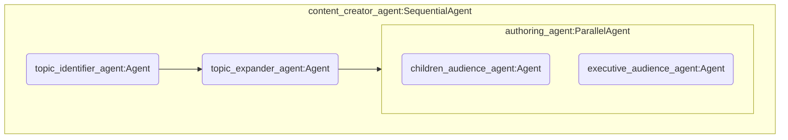
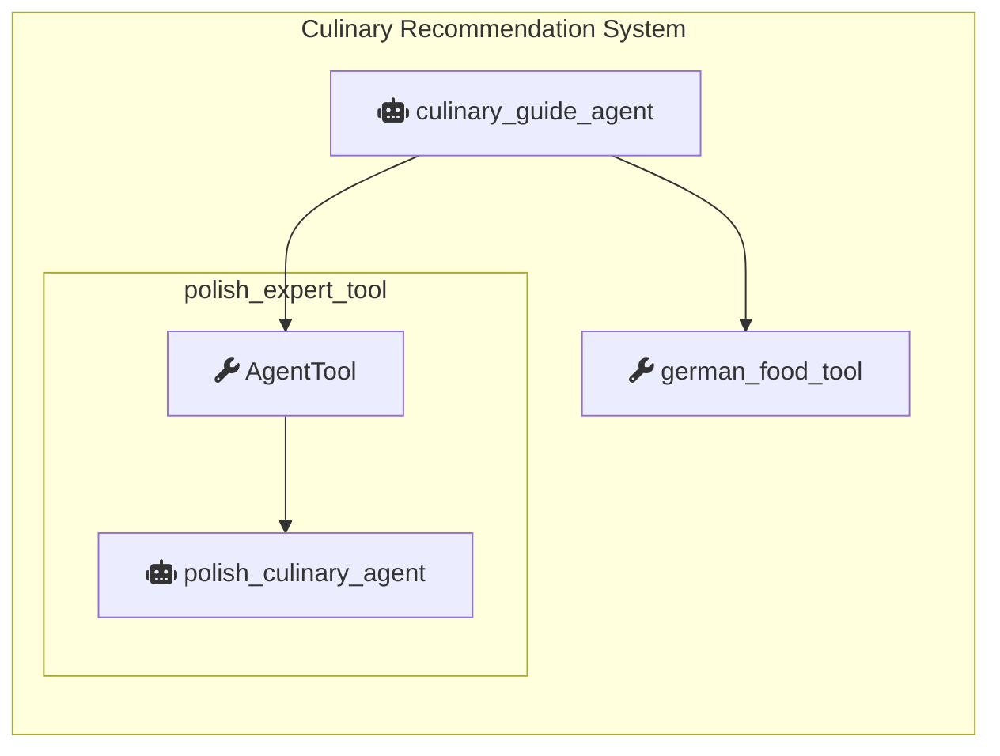

# Eskadra Bielik - Misja 1 - ADK + Cloud Run + Bielik

Przykładowy kod źródłowy pozwalający na:

* Skonfigurowanie własnej instancji modelu [Bielik](https://ollama.com/SpeakLeash/bielik-4.5b-v3.0-instruct) w oparciu o [Ollama](https://ollama.com/)

* Skonfigurowanie prostych systemów agentowych przy wykorzystaniu [Agent Development Kit](https://google.github.io/adk-docs/)

* Uruchomienie obu powyższych serwisów na [Cloud Run](https://cloud.google.com/run?hl=en)

## 1. Przygotowanie projektu Google Cloud

1. Uzyskaj kredyt Cloud **OnRamp**, lub skonfiguruj płatności w projekcie Google Cloud

2. Przejdź do **Google Cloud Console**: [console.cloud.google.com](https://console.cloud.google.com)

3. Stwórz nowy projekt Google Cloud i wybierz go aby był aktywny

>[!TIP]
>Możesz sprawdzić dostępność kredytów OnRamp wybierając z menu po lewej stronie: Billing / Credits

4. Otwórz Cloud Shell ([dokumentacja](https://cloud.google.com/shell/docs))

5. Sklonuj repozytorium z przykładowym kodem i przejdź do nowoutworzonego katalogu

   ```bash
   git clone https://github.com/speakleash/eskadra-bielik-misja1
   cd eskadra-bielik-misja1
   ```

6. Zmień nazwę pliku `.env.sample` na `.env`

   ```bash
   mv .env.sample .env
   ```

7. Zaktualizuj odpowiednie na tym etapie zmienne środowiskowe w pliku `.env`
      * `BIELIK_EVENT_ID`- Identyfikator warsztatów zgodny z kodem użytym w OnRamp Credits
      * `GOOGLE_CLOUD_LOCATION`- zmienną definiującą region Google Cloud
      * `BIELIK_SERVICE_NAME` - domyślną nazwę dla usługi gdzie uruchomimy Bielika
      * `BIELIK_MODEL_NAME` - wersję Bielika z której będziemy korzystać

>[!TIP]
>W terminalu `Cloud Shell` dostępny jest edytor po wybraniu opcji *Open Editor*

   ```bash
   BIELIK_EVENT_ID="<IDENTYFIKATOR>"
   GOOGLE_CLOUD_LOCATION="europe-west1"  # Europe (Belgium)
   BIELIK_SERVICE_NAME="ollama-bielik-v3"
   BIELIK_MODEL_NAME="SpeakLeash/bielik-4.5b-v3.0-instruct:Q8_0"
   ```

>[!IMPORTANT]
>Jeżeli zmieniasz w `BIELIK_MODEL_NAME` domyślny model Bielika na inną wersję, to zaktualizuj tę informację również w pliku `ollama-bielik/Dockerfile`

   ```dockerfile
   ENV MODEL SpeakLeash/bielik-4.5b-v3.0-instruct:Q8_0
   ```

8. Wczytaj zmienne środowiskowe korzystając z podręcznego skryptu

   ```bash
   source reload-env.sh
   ```

## 2. Własna instancja Bielika

1. Ustal domyślne konto serwisowe dla wybranego projektu `default service account`

   ```bash
   gcloud builds get-default-service-account
   ```

2. Poniższa komenda stworzy nową usługę w Cloud Run o nazwie takiej jak wartość zmiennej `$BIELIK_SERVICE_NAME`. Na podstawie definicji w `ollama-bielik/Dockerfile` narzędzie `gcloud` stworzy odpowiedni kontener, skonfiguruje usługę Ollama oraz wczyta odpowiednią wersję modelu Bielik.

   ```bash
   gcloud run deploy $BIELIK_SERVICE_NAME --source ollama-bielik/ --region $GOOGLE_CLOUD_LOCATION --concurrency 7 --cpu 8 --set-env-vars OLLAMA_NUM_PARALLEL=4 --gpu 1 --gpu-type nvidia-l4 --max-instances 1 --memory 16Gi --allow-unauthenticated --no-cpu-throttling --no-gpu-zonal-redundancy --timeout 600 --labels dev-tutorial=codelab-dos-$BIELIK_EVENT_ID
   ```

>[!TIP]
>Alternatywnie, możesz uruchomić powyższą komendę korzystając ze skryptu `deploy-bielik.sh`

   ```bash
   source deploy-bielik.sh
   ```

>[!CAUTION]
>Flaga `--allow-unauthenticated` udostępnia usługę publicznie w internecie i każdy kto zna URL, może zaczać z niej korzystać. W środowisku produkcyjnym zazwyczaj trzeba tę flagę usunąć i odpowiednio skonfigurować reguły dostępu.

3. Uruchom poniższą komendę, aby sprawdzić pod jakim URL jest dostępny Bielik

   ```bash
   gcloud run services describe $BIELIK_SERVICE_NAME --region=$GOOGLE_CLOUD_LOCATION --format='value(status.url)'
   ```

>[!TIP]
>Odpowiedz twierdząco, jeżeli system spyta o włączenie odpowiednich API oraz stworzenie rejestru artefaktów

4. Przypisz powyższy URL do zmiennej środowiskowej `OLLAMA_API_BASE` w pliku `.env` i następnie wczytaj zmienne środowiskowe ponownie:

   ```bash
   source reload-env.sh
   ```

### Jak sprawdzić, czy nasz Bielik jest gotowy?

* Sprawdź w Google Cloud console czy nowy serwis jest już dostępny
* Sprawdź czy otwierając URL w przeglądarce zobaczysz informację: `Ollama is running`
* Sprawdź przez API jakie modele są dostępne lokalnie na serwerze Ollama

   ```bash
   curl "${OLLAMA_API_BASE}/api/tags"
   ```

* Wyślij zapytanie przez API

   ```bash
   curl "${OLLAMA_API_BASE}/api/generate" -d "{
      \"model\": \"$BIELIK_MODEL_NAME\",
      \"prompt\": \"Kto zabił smoka wawelskiego?\",
      \"stream\": false
   }"
   ```

## 3. Konfiguracja systemów agentowych ADK

1. Skonfiguruj swój własny klucz Gemini API
   * Stwórz lub skopiuj istniejący Gemini API key z [Google AI Studio](https://ai.dev).
   * Dodaj wartość klucza ze swojego Gemini API key jako wartość zmiennej `GOOGLE_API_KEY` w pliku `.env`

   ```bash
   GOOGLE_API_KEY=TWÓJ_KLUCZ
   ```

2. Wczytaj zmienne środowiskowe ponownie

   ```bash
   source reload-env.sh
   ```

3. Przejdź do katalogu z agentami

   ```bash
   cd adk-agents
   ```

4. Stwórz i aktywuj wirtualne środowisko Python

   ```bash
   python -m venv .venv
   source .venv/bin/activate
   ```

5. Zainstaluj wymagane komponenty

   ```bash
   pip install -r requirements.txt
   ```

## 4. Przykładowe systemy agentowe

### 4.1 System agentowy - Twórca treści (`content_creator`)

Ten prosty system agentowy, działający jedynie w oparciu o model Bielik, jest prostym przykładem wykorzystania [LLM Agents](https://google.github.io/adk-docs/agents/llm-agents/) oraz [Workflow Agents](https://google.github.io/adk-docs/agents/workflow-agents/) dostępnych w ADK. System ma na celu generowanie artykułów dla różnych grup docelowych (dzieci, kadra zarządzająca) w oparciu o temat zasugerowany przez użytkownika.

* `content_creator_agent` - Główny, sekwencyjny agent, uruchamia pod-agentów jeden po drugim
* `topic_identifier_agent` - Agent LLM odpowiedzialny za zidentyfikowanie tematu którym interesuje się użytkownik.
* `topic_expander_agent` - Agent LLM odpowiedzialny za rozwinięcie tematu. Generuje listę ciekawych faktów związanych z tematem.
* `authoring_agent` - Agent równoległy - uruchamia pod-agentów równolegle. Zawiera dwóch pod-agentów, po jednym na każdą grupę docelową
* `children_audience_agent` - Agent LLM odpowiedzialny za tworzenie treści skierowanych do dzieci.
* `executive_audience_agent` - Agent LLM odpowiedzialny za tworzenie treści skierowanych do kadry zarządzającej.



1. Upewnij się, że jesteś w katalogu `adk_agents` oraz że wszystkie zmienne środowiskowe są załadowane
2. Uruchom agenta w konsoli **Cloud Shell** i rozpocznij interakcję

   ```bash
    adk run content_creator/
   ```

### 4.2 System agentowy - Przewodnik kulinarny (`culinary_guide`)

Ten hybrydowy system agentowy, działający w oparciu o modele Gemini i Bielik, jest przykładem wykorzystania Agentów LLM ([LLM Agents](https://google.github.io/adk-docs/agents/llm-agents/)), funkcji-jako-narzędzi ([Function Tools](https://google.github.io/adk-docs/tools/function-tools/#function-tool)) oraz agentów-jako-narzędzi ([Agent-as-a-tTool](https://google.github.io/adk-docs/tools/function-tools/#agent-tool)) dostępnych w ADK.

System ma na celu pełnienie roli międzynarodowego przewodnika kulinarnego, który deleguje zadania do wyspecjalizowanych pod-agentów lub narzędzi w zależności od kraju, o który pyta użytkownik.

* `culinary_guide_agent` - Główny agent, który komunikuje się z użytkownikiem w języku angielskim. Jego zadaniem jest zrozumienie prośby o rekomendacje kulinarne, identyfikacja kraju i preferencji dietetycznych, a następnie delegowanie zadania do odpowiednich narzędzi.
* `polish_expert_tool` - Narzędzie typu AgentTool, które opakowuje agenta polish_culinary_expert_agent, umożliwiając głównemu agentowi korzystanie z jego wyspecjalizowanych zdolności.
* `polish_culinary_expert_agent` - Wyspecjalizowany Agent LLM oparty na modelu Bielik, ekspert w dziedzinie kuchni polskiej. Przyjmuje zapytania i odpowiada wyłącznie w języku polskim.
* `german_food_tool` - Proste narzędzie oparte na funkcji Pythona, które dostarcza rekomendacji kulinarnych dla Niemiec w oparciu o zdefiniowaną logikę.



1. Upewnij się, że jesteś w katalogu `adk_agents` oraz że wszystkie zmienne środowiskowe są załadowane
2. Uruchom agenta w konsoli **Cloud Shell** i rozpocznij interakcję

   ```bash
    adk run culinary_guide_agent/
   ```

## 5. Przetestuj systemy agentowe w środowisku Cloud Shell + Web

1. Upewnij się, że jesteś w katalogu `adk_agents` oraz że wszystkie zmienne środowiskowe są załadowane
2. Uruchom środowisko ADK Web

    ```bash
    adk web
    ```

3. Zmień port w **Web View** (jeżeli potrzeba, zazwyczaj jest to port 8000)
4. Zaakceptuj zmiany poprzez: *Change and Preview*
5. Z rozwijanego menu po lewej stronie ekranu wybierz system z którym chcesz pracować

## 6. Uruchom systemy agentowe w Cloud Run

1. Upewnij się, że jesteś w katalogu `adk_agents` oraz że wszystkie zmienne środowiskowe są załadowane

    ```bash
    gcloud run deploy adk-agents --source . --region $GOOGLE_CLOUD_LOCATION --allow-unauthenticated --set-env-vars GOOGLE_CLOUD_LOCATION=$GOOGLE_CLOUD_LOCATION --set-env-vars OLLAMA_API_BASE=$OLLAMA_API_BASE --set-env-vars GOOGLE_API_KEY=$GOOGLE_API_KEY --labels dev-tutorial=codelab-dos-$BIELIK_EVENT_ID
    ```

>[!TIP]
>Alternatywnie, możesz uruchomić powyższą komendę korzystając ze skryptu `deploy-adk-agents.sh`

   ```bash
   source deploy-adk-agents.sh
   ```

>[!CAUTION]
>Flaga `--allow-unauthenticated` udostępnia usługę publicznie w internecie i każdy kto zna URL, może zaczać z niej korzystać. W środowisku produkcyjnym zazwyczaj trzeba tę flagę usunąć i odpowiednio skonfigurować reguły dostępu.

2. Narzędzie `gcloud` stworzy kontener na podstawie konfiguracji zawartej w `adk-agents/Dockerfile` i uruchomi usługę w Cloud Run, podając URL pod którym serwis będzie dostępny
3. Wywołaj otrzymany URL w przeglądarce WWW aby mieć dostęp do środowiska ADK Web
